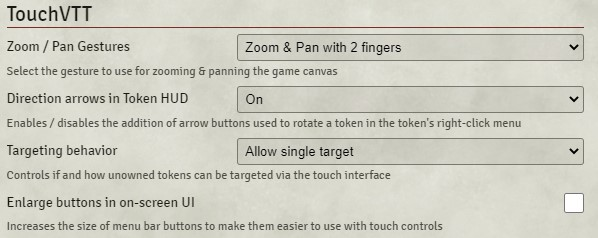
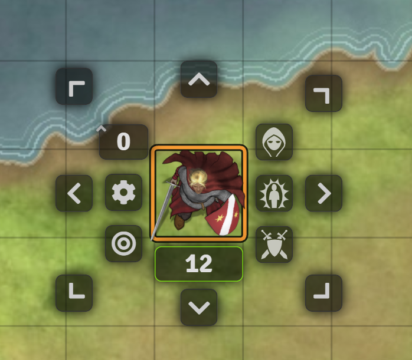
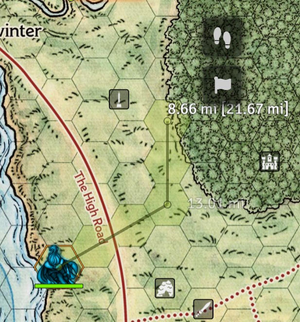
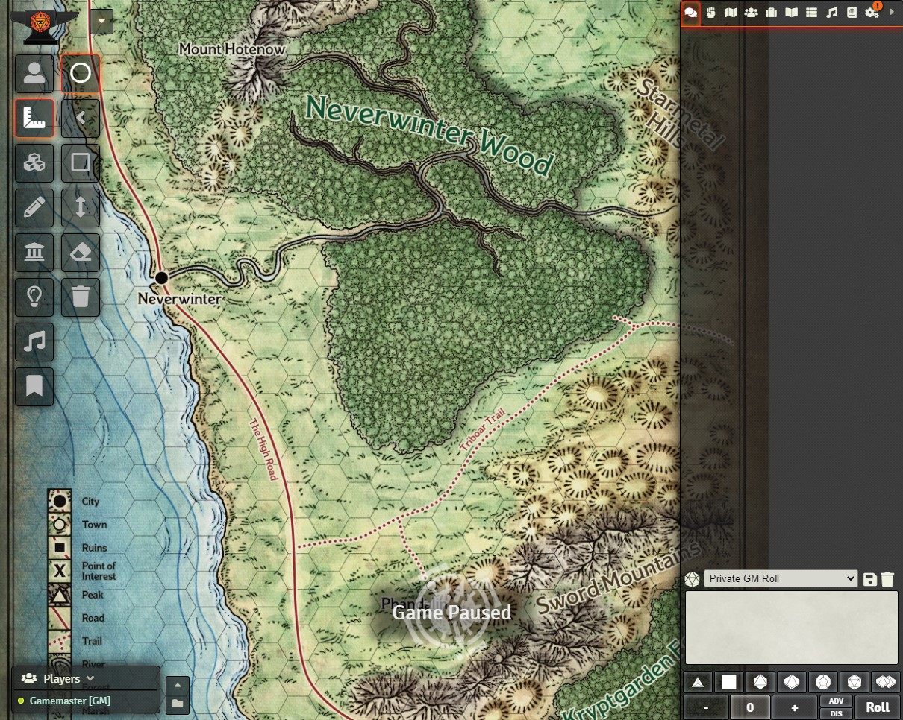
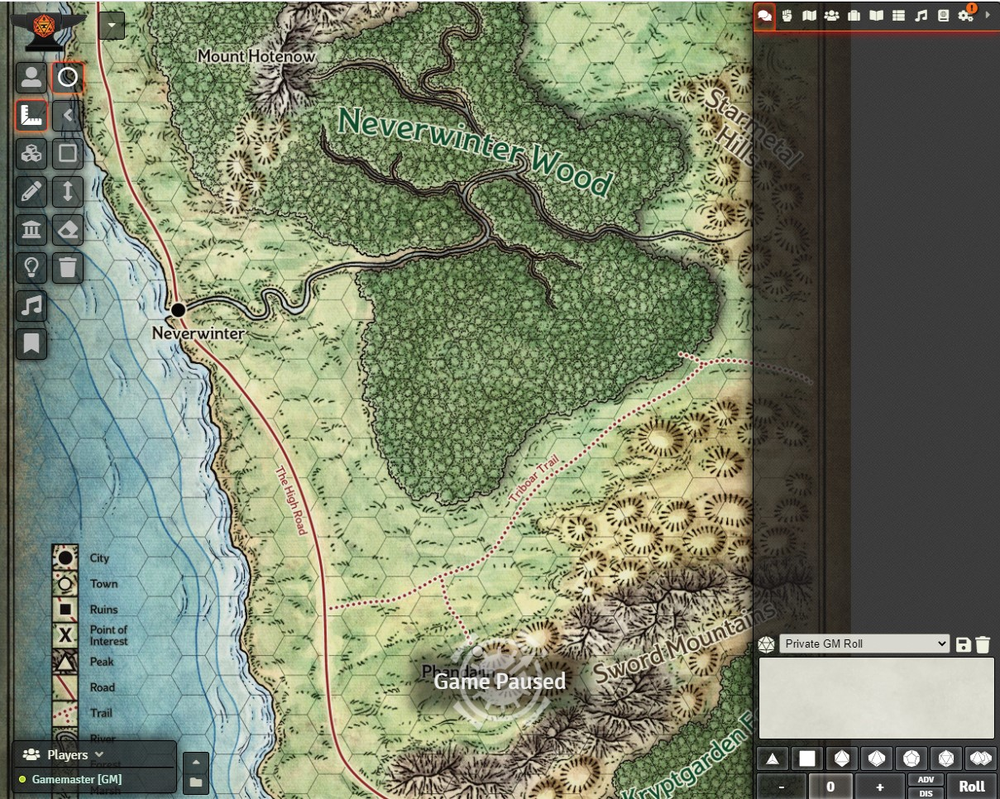

# TouchVTT

Introduces touch screen support to FoundryVTT. If you have a tablet, a PC or a TV equipped with a 
touch screen and want to play on FoundryVTT, this module is for you!

Features:
 - Use two-finger pinching and panning gestures to zoom and pan the map. Panning can be turned off for this gesture 
   in the settings (use three fingers to pan if you change this).
 - Move tokens by dragging them with your finger - just as you would with the mouse
 - Move three fingers around on the canvas to pan the scene - no zooming in this mode.
 - Rotate tokens using the (optional) directional buttons added to the token right-click menu (HUD)
 - Target hostile tokens quickly by tapping them.
 - Use your ruler with waypoints and move your token along the measured path using a Touch-Only UI
 - Need to right-click to access the corresponding functionality on a game world entity? Just long-press (0.5s) 
    with your finger.
 - Move windows around and interact with their content intuitively
 - Removing measurement templates usually requires you to press the DELETE key on your keyboard. TouchVTT 
    adds an eraser tool to the measurement templates menu that can be used with touch controls. First tap 
    the eraser tool, then tap the template you want to remove.
 - Additional wall placement tools that work with touch controls
 - Enlarge the menu buttons (on the left) to make them easier to use with touch controls

Primary use cases:
 - You and your group play in person and you want to use Foundry to visualize gameplay - just put a touchscreen 
   device in the middle of the table, install TouchVTT and you'll be good to go!
 - You like playing on your couch where a touch device is just so much more convenient than a laptop
 
### Settings

#### Zoom / Pan Gestures

- **Zoom & Pan with 2 fingers:** Combined zooming and panning behavior. Should feel most natural and is thus the 
    default. Due to the varying accuracy of touch sensors, you may experience some jittering while moving the 
    camera using this mode - the less accurate your touch sensor, the more jitter you will have.
- **Zoom with 2 fingers, pan with 3 fingers:** Pinch 2 fingers to zoom, move 3 fingers on the canvas to pan. 
    Use this if you experience issues with the default mode (or just use if because you like it better :) )

#### Direction arrows in HUD

- **On:** Shows arrow buttons in a token's HUD (right-click menu) allowing users to change the direction the token 
    is facing without the use of a keyboard:
    
- **Off:** Disables the above-mentioned arrows, shows the default token HUD

This is a drop-down setting instead of a checkbox because there might be other methods to change token direction 
in the future.

#### Targeting behavior

- **Off:** Targeting is unchanged from how FoundryVTT handles it natively
- **Allow single target:** Tap a token you don't own to target it. Other targets will be released. Tap this token or any other token again to un-target it.
- **Allow multiple targets:** Tap a token you don't own to target it in addition to any other targets you selected. Tap this token again to un-target it.

#### Measurement HUD

- **Off:** No touch UI for setting ruler waypoints or moving your token along a measured path
- **Show right:** Shows a touch-friendly UI to the top-right of where you currently drag your ruler. 
    Use another finger to set waypoints (Flag icon) or to move your token (footprints icon). Recommended for right-handed people.
- **Show left:** Same as `Show right`, just on the left-hand side, optimized for left-handed people.

#### Enlarge buttons in on-screen UI

- **Checked:** Makes buttons in the left-hand menu structure easier to hit by making them larger:
    
- **Unchecked:** Default button size
    

### Compatibility with other modules

This module changes the behavior of several aspects of FoundryVTT by overriding many methods (especially wall and 
measurement controls at the moment). I implemented all that with compatibility to other modules in mind by using 
[libWrapper](https://foundryvtt.com/packages/lib-wrapper/). If you experience any issues that could stem from module 
incompatibility, please install and activate libWrapper. 

The [Lock View](https://foundryvtt.com/packages/LockView/) module is supported. Touch zooming and panning is disabled 
when those features are locked in "Lock View".

### Changelog

- **1.10.0:** Compatibility with FoundryVTT version 10
- **1.9.1:** Compatibility with FoundryVTT version 9
- **1.8.1:** Fixed missing template for Measurement HUD, added German Translation files
- **1.8.0:** Added a Measurement HUD, a UI for the ruler allowing touch-based creation of waypoints and moving tokens along a measured path.
- **1.7.2:** Fixed not being able to move tokens as a GM due to a conflict with the EasyTarget module
- **1.7.1:** Restricted targeting to the select tool
- **1.7.0:** Added ability to target unowned tokens by simply tapping them with your finger.
- **1.6.0:** Added button to delete the currently selected drawing.
- **1.5.1:** Fixed players being able to rotate their token while the game is paused. Moved enlarge buttons feature from wall tools menu to module settings.
- **1.5.0:** Added arrow buttons to the token HUD, allowing touchscreen users to rotate their token (long-press the token to activate the HUD). Added missing translation files.
- **1.4.0:** Added snap-to-grid toggle for token movement controls
- **1.3.1:** Fixed bug with compatibility between TouchVTT and LockView
- **1.3.0:** Added setting to split zoom and pan gestures. 3 and 4 finger gestures now always pan the map. Added compatibility with [Lock View](https://foundryvtt.com/packages/LockView/).
- **1.2.3:** Added support for module compatibility library [libWrapper](https://foundryvtt.com/packages/lib-wrapper/)
- **1.2.0:** Added support for wall tools
- **1.1.0:** Added touch support for measurement templates
- **1.0.0:** Initial release. Zooming & panning with 2 fingers, token movement

### About

Disclaimer: I also made the "Touch20" browser extension for Roll20, TouchVTT is my contribution to FoundryVTT.

Feel free to suggest features and report bugs via Github issues!

If you want to show your support for my work financially, feel free to donate via PayPal - it's greatly appreciated! 

